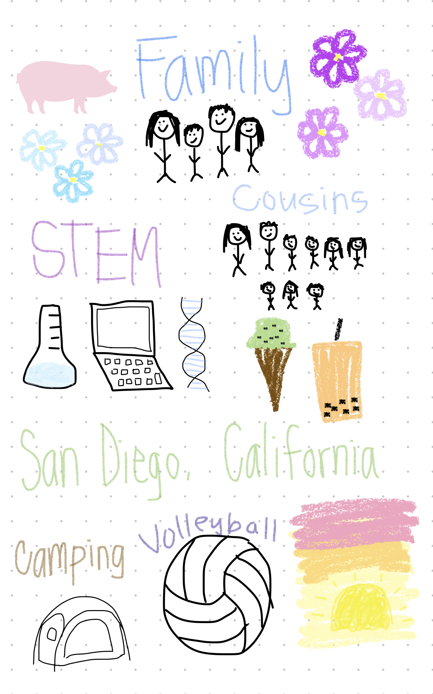

# Katie's Page
Welcome to my blog! This page is dedicated to letting you know a bit more about me.

## About Me
- Hi! My name is Katie. 😄
- I am a current junior at Del Norte High School.
- I am very interested in the field of STEM

## My Trimester 1 Class Schedule
| Period - Class |
| 1 - AP English Language |
| 2 - Bridge/AP Calculus BC  Seminar |
| 3 - AP Chemistry |
| 4 - AP Computer Science Principles |
| 5 - Off roll |

  I was born in the year 2007, which according to the Chinese Zodiac calendar is the year of the pig. In fact, 2007 was actually the year of the golden pig which is a special year and people born in the year of the golden pig are believed to have good fortune. Also, I am the oldest of 11 cousins on my mom's side we often all get together at least several times a month as well as go on camping trips together during the holidays. I have lived in San Diego for my whole life but I also enjoy traveling and seeing new places. Additionally, I play volleyball, enjoy looking at the sunset, and love boba and ice cream. I am really passionate about STEM and the fields of biology, medicine, and computer science really interest me. 

